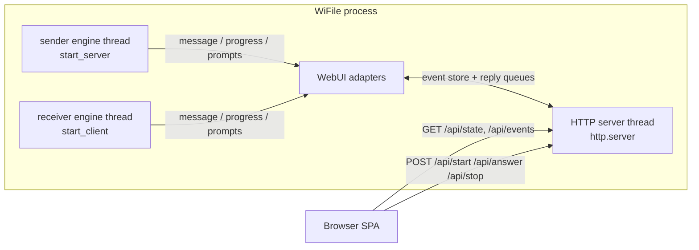

# WiFile UI Implementation Plan

Status: approved — decisions locked (see [Decisions](#decisions)).

## Goal

Add a web UI to WiFile while keeping the CLI exactly as it is today: same
arguments, same prompts, same output, and the existing 39 tests still
passing. The CLI remains the reference client; the web UI is a second front
end on the same transfer engine, usable from any browser on the network.

## Constraint & key decision

The core engine in `wifile.py` mixes transfer logic with console I/O
(`print`, `input`, `show_progress`) and runs an infinite loop stopped only by
`Ctrl+C`. Three ways to put a UI on top:

| Strategy | Touches `wifile.py`? | Robustness |
|---|---|---|
| **A. UI seam (recommended)** — add a `UI` interface with a `ConsoleUI` default | Yes, internals only; CLI behavior identical | High, fully testable |
| B. Subprocess driver — GUI spawns the CLI and parses stdout / feeds stdin | No | Fragile: `\r` progress parsing, PTY on Windows, no structured events |
| C. Monkeypatch `builtins.input` + `sys.stdout` at import | No | Hacky; same parsing problems as B |

**Decision: A**, because it keeps a single engine, is testable, and the CLI
stays byte-for-byte identical. (If `wifile.py` must remain literally
untouched, B was the fallback.)

### A vs B explained

**A — UI seam.** `wifile.py` gets a `UI` interface with a `ConsoleUI` default;
every `print`/`input`/`show_progress` call is routed through it. The CLI path
(`main()`, argparse) is untouched and produces byte-identical behavior, so the
33 existing tests (which mock `builtins.input` and capture stdout) keep
passing. The web backend supplies a `WebUI` implementation and receives
structured events — no text parsing. The cost is a mechanical refactor inside
`wifile.py`, fully guarded by the existing test suite.

**B — zero-touch subprocess driver.** `wifile.py` is not modified. The web
backend launches `python wifile.py server ...` as a child process and talks to
it over stdin/stdout: it answers `input()` prompts by writing to stdin and
shows progress by parsing stdout. This has serious practical problems:

- **Output buffering:** when stdout is a pipe (not a terminal), Python block-
  buffers it, so lines sit in the buffer instead of reaching the UI. Getting
  terminal-like behavior requires a pseudo-terminal, which on Windows needs
  extra tooling (`pywinpty`, conhost) and remains fragile.
- **No structured events:** progress is a `\r`-rewritten bar of block
  characters; "sent" vs "error" must be inferred by matching free text, so any
  wording change in `wifile.py` silently breaks the UI.
- **Two processes, more moving parts:** lifecycle, startup, and error handling
  all become more complex and harder to test headlessly.

B's only real advantage is that `wifile.py` stays byte-identical. For a web UI
that needs clean progress and prompt handling, **A was chosen**.

## UI technology

A **web UI**: a small HTTP server built into WiFile that serves a single-page
browser app. Any device on the network — laptop, tablet, phone — can operate
WiFile without installing anything.

- **Stack (decided): Python standard library `http.server`** — keeps the
  project's "no external dependencies" promise, serving a static HTML/JS page
  plus JSON endpoints.
- **Live updates (decided): Server-Sent Events (SSE)**, with JSON polling as a
  fallback.
- *Rejected alternative: Flask* — less code, but adds a third-party
  dependency.

## The seam in `wifile.py`

Introduce a small protocol + default implementation (no CLI-visible change):

```python
class UI(Protocol):
    def message(self, text: str) -> None: ...                    # replaces all print()
    def progress(self, current, total, start_time) -> None: ...  # replaces show_progress()
    def choose(self, options, prompt, default) -> str: ...       # o/r/c, s/n/e, c/n/e prompts
    def ask_text(self, prompt) -> str: ...                       # path / output-dir entry
    def should_stop(self) -> bool: ...                           # replaces Ctrl+C-only stop
```

- `ConsoleUI` implements today's behavior **verbatim**: `message` → `print()`,
  `choose`/`ask_text` → `input()`, `progress` → the existing `show_progress`
  body, `should_stop` → `False`. This matters because the existing tests mock
  `builtins.input` and capture `sys.stdout` — those still work untouched.
- `start_server`, `start_client`, `send_one_file`, `receive_one_file`,
  `receive_batch`, and the three prompt functions get an optional keyword-only
  `ui=None` parameter defaulting to `ConsoleUI()`. `main()` is **not
  modified**.
- Loop condition changes from `while True` + `KeyboardInterrupt` to
  `while not ui.should_stop()`; `ConsoleUI` never returns `True`, so CLI
  Ctrl+C behavior is unchanged. This also solves a real web-UI problem:
  `KeyboardInterrupt` is only delivered to the main thread, so a stop flag is
  the clean way for the UI to cancel.

## Threading model

Socket I/O must never block the HTTP request/response cycle, and the engine
must never touch the HTTP layer directly — all interaction goes through a
thread-safe event store:



- Two independent engine threads run as daemons — one for send, one for
  receive. Each has its own `WebUI` view of a mode-tagged, thread-safe store
  (bounded log ring buffer + current prompt + stop flag per mode).
- Prompts block the worker until the browser answers — `choose`/`ask_text`
  wait on a per-prompt `queue.Queue` that a `POST /api/answer` fulfills
  (prompt ids are mode-tagged). Safe because the wire protocol's
  `DECISION_TIMEOUT` (300 s) leaves ample room for a user to click a button.
- Progress events fire every 1 KB chunk; `WebUI` throttles to ~10 updates/sec
  so polling/SSE traffic stays light.
- The HTTP server binds to `127.0.0.1` by default; a `--host 0.0.0.0` flag
  opts into LAN access (see Risks).

## Web UI design

Single-page app with two panes shown side by side (or stacked on narrow
screens); each pane has its own status, progress, and log:

- **Send pane**: file/folder path field **and a drop zone** — files or
  folders dropped onto the zone are uploaded by the browser to a temp uploads
  directory and then served. Port field, Start/Stop buttons, progress bar
  with speed/ETA, subtle log pane. The CLI's `s`/`n`/`e` prompt becomes three
  buttons: *Send same*, *New file/folder*, *Stop*.
- **Receive pane**: host, port, output directory, conflict-mode radio
  (*Ask me* / *Overwrite* / *Auto-rename*), Start/Stop, progress bar. Name
  conflicts show a dialog with *Overwrite / Rename / Cancel*; after a batch,
  buttons for *Continue here*, *New location*, *Stop*.
- Folder (batch) transfers show a per-file list with sent/received/pending
  status.
- Both panes run independently at the same time; a loopback transfer (send to
  yourself) is supported.

HTTP API:

| Endpoint | Method | Purpose |
|---|---|---|
| `/` | GET | serve the static SPA |
| `/api/state?mode=server|client` | GET | JSON: running, log tail, progress, pending prompt |
| `/api/events` | GET | SSE stream of state changes for both panes (polling fallback) |
| `/api/start` | POST | `{mode, host, port, source?, output_dir?, conflict_mode}` — starts that engine thread |
| `/api/upload` | POST | multipart: browser-uploaded files/folders land in a temp uploads dir |
| `/api/answer` | POST | `{mode, prompt_id, choice}` — answers a pane's pending prompt |
| `/api/stop` | POST | `{mode}` — set that engine's stop flag; it exits its loop |

## Proposed file layout

```
WiFile/
├── wifile.py               # + UI protocol, ConsoleUI, routed I/O (CLI unchanged)
├── webui.py                # entry point: python webui.py [--port 8000] [--host 127.0.0.1]
├── wifile_web/
│   ├── __init__.py
│   ├── state.py            # thread-safe store, one slot per mode: logs, progress, prompt
│   ├── adapter.py          # WebUI: UI protocol → store; blocks on prompt replies
│   ├── server.py           # http.server handlers, /api/upload, engine thread lifecycle
│   └── static/
│       ├── index.html      # single-page app (server / client views)
│       ├── app.js          # fetch/SSE plumbing, prompt buttons, progress bar
│       └── style.css
├── test_wifile.py          # untouched — regression guarantee (33 tests)
└── test_wifile_web.py      # new: adapter routing, state store, API endpoints (headless)
```

## Execution phases

1. **Refactor seam** ✅ — add `UI`/`ConsoleUI`, route all `print`/`input`/
   `show_progress` through it, add `should_stop`. Gate: `python -m unittest`
   must be 39/39 green with zero diff in CLI output. (Done; all 39 pass.)
2. **Backend** ✅ — `WebUI` adapter + two-slot state store + `http.server`
   handlers incl. `/api/upload`; headless tests using `http.client` against a
   temporary port. (Done; 24 new tests, 63 total green.)
3. **Frontend** ✅ — static SPA: two panes with log, progress bar, drop zone,
   prompt buttons, start/stop forms; verified against the existing CLI peer.
   (Done; light theme, SSE live indicator, upload pickers, per-file chips.)
4. **Live updates** — SSE stream with polling fallback; batch file list.
5. **Polish** — localhost-by-default warning, graceful shutdown on Stop and on
   browser disconnect, error dialogs for bad paths/ports.

## Risks

- The ~30 `print()` call sites need mechanical routing; risk is low but the
  phase-1 test gate covers it.
- Renaming `input` semantics must be avoided — `ConsoleUI` must keep calling
  `builtins.input` so existing mocks keep working.
- **Remote path input = arbitrary local file read.** Whoever can reach the web
  UI can ask the server to send any local file or folder. Mitigations: bind
  `127.0.0.1` by default, print a loud warning for `--host 0.0.0.0`, document
  that there is no authentication, and (optional) restrict sources to a
  configured root directory.
- Engine thread and HTTP thread share state only through the locked store;
  prompts block the worker, so a stale tab that never answers must not hang
  the engine forever — time prompts out or auto-answer "cancel".
- Uploads live in a temp directory; clean them up after a transfer is served
  and bound the directory size so the disk can't fill up.
- Two sender engines can't share one transfer port; the web UI allows at most
  one active sender (a receiver can still run, since it only connects). The
  web UI and the CLI must not run a sender on the same transfer port at the
  same time.

## Decisions

1. **Stack:** standard-library `http.server` (zero dependencies) — decided.
2. **Live updates:** Server-Sent Events — decided.
3. **Seam approach:** A (UI seam) — decided.
4. **Visual style:** light theme — decided.
5. **Server file source:** path entry + browser upload (drag-and-drop) —
   decided.
6. **Run modes:** simultaneous send and receive — decided.

## Design direction

The UI should be **slick, simple, modern, and minimalist**: a clean single
page in a light theme with one accent color, generous whitespace, no clutter,
one focused progress indicator per pane, a subtle log, and prompts rendered
as inline buttons rather than pop-up dialogs. Send and Receive are two
side-by-side panes on one page, each independently operable.
